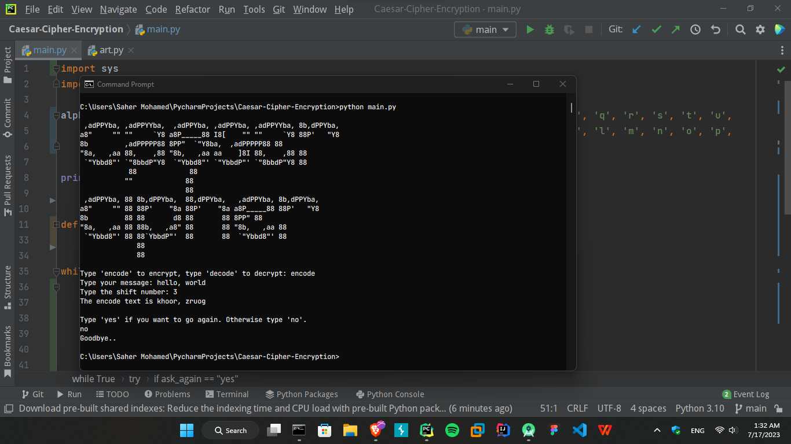

# Caesar Cipher
This is a Python script that implements the Caesar Cipher encryption and decryption algorithm. The Caesar Cipher is a substitution cipher where each letter in the plaintext is shifted a certain number of positions down or up the alphabet.

## Usage
1. Run the script in a Python environment.
2. Follow the prompts to choose the encryption or decryption mode, enter the text to process, and specify the shift number.
3. The script will display the resulting text according to the chosen mode.

## Prerequisites
- Python 3.x

## Screenshots


## Installation
1. Clone the repository or download the script directly.
2. Ensure you have Python 3.x installed on your machine.

## Features
- It supports both `encrypt` and `decrypt` process.
- All you have to do is just provide the `shift key` to encrypt or decrypt.
## How to Run
1. Open a terminal or command prompt.
2. Navigate to the directory where the script is located.
3. Run the following command:
    ```commandline
    python main.py
    ```

4. Follow the on-screen instructions to interact with the script. Example:
    ```text
    Type 'encode' to encrypt, type 'decode' to decrypt: encode
    Type your message: hello
    Type the shift number: 3
    The encode text is khoor
    
    Type 'yes' if you want to go again. Otherwise type 'no'.
    no
    Goodbye..
    ```
